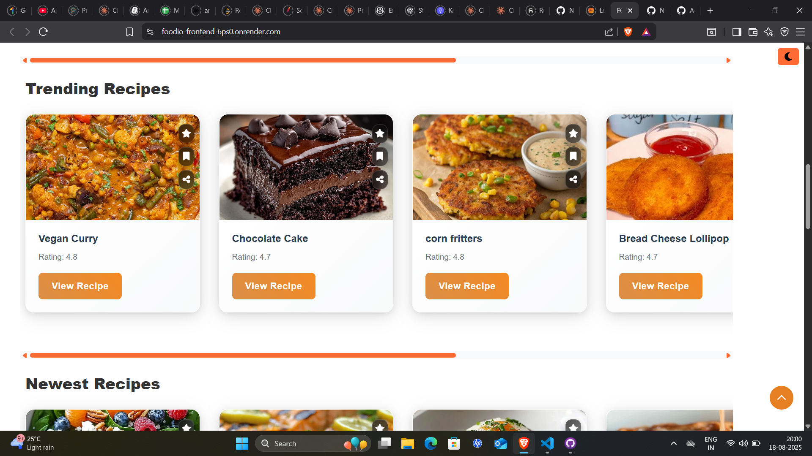
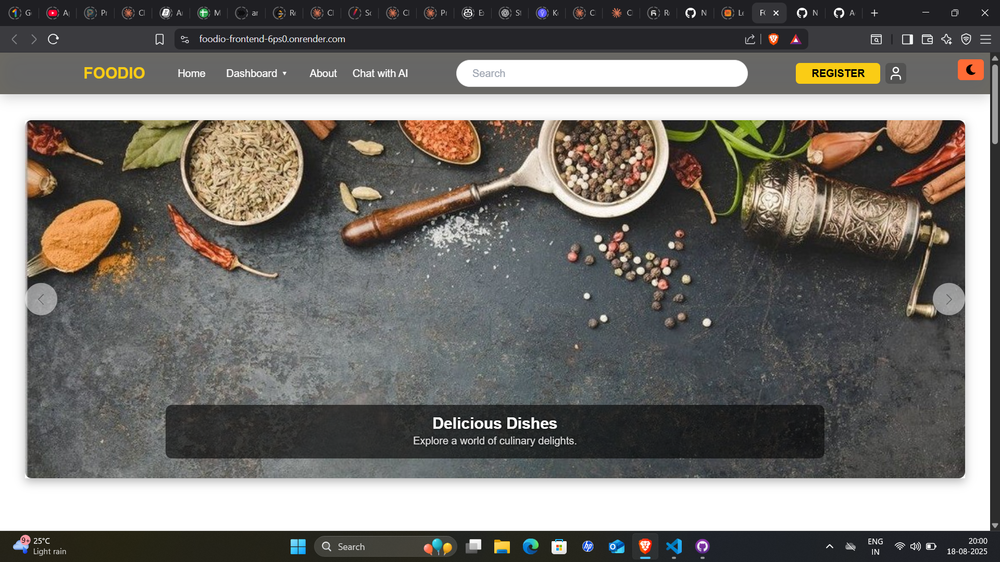

<h1 align="center">Foodio 🍽️</h1>

<p align="center">
  <strong>A full-stack recipe sharing platform that brings food lovers together to create, share, and discover amazing dishes.</strong>
  <br />
  <br />
  <a href="#-getting-started-in-under-5-minutes"><strong>🚀 Get Started</strong></a>
  ·
  <a href="https://github.com/Prashanti-Hebbar/FoodIO/issues"><strong>🐛 Report a Bug</strong></a>
  ·
  <a href="https://github.com/Prashanti-Hebbar/FoodIO/issues"><strong>✨ Request a Feature</strong></a>
</p>

<p align="center">
  <a href="https://github.com/Prashanti-Hebbar/FoodIO/stargazers"></a>
  <a href="https://github.com/Prashanti-Hebbar/FoodIO/blob/main/LICENSE"></a>
  <a href="https://github.com/Prashanti-Hebbar/FoodIO/network/members"></a>
</p>

---

## 🌟 The Mission: Democratizing Culinary Knowledge

In a world where great recipes are often locked away in family traditions or expensive cookbooks, **Foodio** breaks down barriers by creating a vibrant, open community where food enthusiasts can share, discover, and perfect their culinary creations.

Whether you're a home cook looking to share your grandmother's secret recipe, a food blogger wanting to reach a wider audience, or someone searching for that perfect dish for tonight's dinner, Foodio connects you with a passionate community of food lovers.

### 🔥 Core Features

- **📝 Add New Recipes**: Users can create and share their own recipes with detailed instructions and ingredients.
- **🔄 Edit Recipes**: Modify existing recipes anytime to perfect your creations.
- **❌ Delete Recipes**: Remove recipes if they are no longer needed.
- **👀 View Recipes**: Browse and discover new recipes shared by others in the community.
- **❤️ Favorite Recipes**: Mark recipes as favorites for easy access to your beloved dishes.
- **📌 Save Recipes**: Save recipes to check later when you're ready to cook.
- **🔗 Share Recipes**: Share recipes via social media or direct links with friends and family.
- **🔍 Search Recipes**: Find recipes quickly using keywords, ingredients, or cuisine types.

---

## 🏗️ System Architecture: Built for Scale and Performance

Foodio leverages the powerful MERN stack to deliver a seamless, responsive user experience with robust backend functionality.

<details>
  <summary><strong>Click to expand the detailed application workflow</strong></summary>

  ### The Life of a Recipe in Foodio

  1.  **User Authentication:** 
      *   Secure user registration and login using JWT tokens
      *   Password hashing with bcrypt.js for enhanced security
  
  2.  **Recipe Creation:**
      *   Intuitive form interface for adding recipes with ingredients and instructions
      *   Image upload capabilities for visual recipe presentation
  
  3.  **Data Storage:**
      *   MongoDB stores recipe data with Mongoose ODM for efficient querying
      *   User profiles and preferences maintained in the database
  
  4.  **Recipe Discovery:**
      *   Advanced search functionality to find recipes by keywords, ingredients, or cuisine
      *   Browse features to explore new dishes from the community
  
  5.  **Social Features:**
      *   Favorite and save recipes for personal collections
      *   Share recipes via social media or direct links
  
  6.  **Real-time Updates:** 
      *   Instant updates when recipes are modified or new ones are added
      *   Responsive design for seamless mobile and desktop experience

</details>

---

## 🚀 The Tech Stack: Built for Modern Web Development

Every technology was chosen for its scalability, developer experience, and proven effectiveness in building modern web applications.

| Component           | Technology                | Rationale & Key Benefits                                                                                |
| ------------------ | ------------------------- | ------------------------------------------------------------------------------------------------------ |
| **Frontend**       | **React**                | **Component-Based.** Modern, efficient UI development with reusable components and state management. |
| **Routing**        | **React Router**         | **Seamless Navigation.** Client-side routing for smooth single-page application experience.          |
| **Styling**        | **Tailwind CSS**         | **Utility-First.** Rapid UI development with responsive design and consistent styling.               |
| **Backend**        | **Node.js & Express.js** | **JavaScript Everywhere.** Fast, scalable server-side development with extensive middleware support. |
| **Database**       | **MongoDB & Mongoose**   | **NoSQL Flexibility.** Document-based storage perfect for recipe data with dynamic schemas.          |
| **Authentication** | **JWT & bcrypt.js**      | **Secure & Stateless.** Token-based authentication with industry-standard password hashing.         |
| **HTTP Client**    | **Axios**                | **Promise-Based.** Reliable API communication with request/response interceptors.                    |

---

## 🛠️ Getting Started in Under 5 Minutes

No complex configuration required. Just clone, install, and run.

### Prerequisites

1.  **Node.js & npm:** Make sure you have Node.js installed. [Get it here](https://nodejs.org/).
2.  **MongoDB:** Local MongoDB installation or MongoDB Atlas account. [Get it here](https://www.mongodb.com/).

### Installation & Launch

1.  **Clone the Project:**
    ```bash
    git clone https://github.com/Prashanti-Hebbar/FoodIO.git
    cd FoodIO
    ```

2.  **Install Dependencies:**
    ```bash
    # Backend dependencies
    cd backend
    npm install
    
    # Frontend dependencies
    cd frontend
    npm install
    npm start
    ```

3.  **🔑 Set Up Environment Variables:**
    
    Create a `.env` file in the server directory:
    ```bash
    MONGO_URI=your_mongodb_connection_string
    JWT_SECRET=your_secret_key
    PORT=5000
    ```

4.  **🎉 Start the Application:**
    ```bash
    # Start backend server
    cd backend
    npm start
    
    # Start frontend server (in new terminal)
    cd frontend
    npm start
    ```
    
    Your app will be running on `http://localhost:3000`!

---


## 📂 Project Structure

```
FoodIO/
│
├── frontend /           # React frontend
│   ├── src/
│   │   ├── components/   # Reusable UI components
│   │   ├── pages/        # Application pages
│   │   ├── hooks/        # Custom React hooks
│   │   └── utils/        # Utility functions
│   └── public/       # Static assets
│
├── backend /           # Express backend
│   ├── models/       # Mongoose models
│   ├── routes/       # API routes
│   ├── controllers/  # Business logic
│   ├── middleware/   # Custom middleware
│   └── config/       # Configuration files
│
└── README.md        # Project documentation
```


## 🤝 Contributing

We welcome contributions from the community! Here's how you can help make Foodio even better:

1. **Fork the Repository**
2. **Create a Feature Branch:** `git checkout -b feature/amazing-feature`
3. **Commit Changes:** `git commit -m 'Add amazing feature'`
4. **Push to Branch:** `git push origin feature/amazing-feature`
5. **Open a Pull Request**

### Development Guidelines

- Follow the existing code style and conventions
- Write meaningful commit messages
- Add appropriate documentation for new features
- Test your changes thoroughly before submitting
- Ensure responsive design for all UI components

---

## 🌟 Contributors

Thanks to these wonderful people who have contributed to Foodio:

<a href="https://github.com/Prashanti-Hebbar/FoodIO/graphs/contributors">
  
</a>

---

## 🐛 Troubleshooting

### Common Issues

**MongoDB Connection Issues:**
- Ensure MongoDB is running locally or your Atlas connection string is correct
- Check if your IP address is whitelisted in MongoDB Atlas

**Port Already in Use:**
- Make sure ports 3000 (frontend) and 5000 (backend) are available
- Kill any existing processes using these ports

**Environment Variables:**
- Double-check your `.env` file is in the server directory
- Ensure all required environment variables are set

---

## 📱 Screenshots & Demo





---

## 🧪 Testing

Run the test suite to ensure everything is working correctly:

```bash
# Backend tests
cd server
npm test

# Frontend tests
cd ../client
npm test
```


## 🪪 License 

This project is licensed under the **MIT License**. See the `LICENSE` file for more information.

---

<div align="center">
  
  <p>Built with ❤️ and a passion for bringing food lovers together.</p>
  
</div>
